# Diagrama de Relacionamentos - Sistema DUE

## Visão Geral

O sistema possui **37 tabelas** organizadas em:
- **23 tabelas DUE**: Dados das Declarações Únicas de Exportação
- **14 tabelas de suporte**: Tabelas auxiliares para joins e referências

---

## Diagrama Principal

```mermaid
erDiagram
    due_principal ||--o{ due_itens : "tem"
    due_principal ||--o{ due_eventos_historico : "tem"
    due_principal ||--o{ due_solicitacoes : "tem"
    due_principal ||--o{ due_situacoes_carga : "tem"
    due_principal ||--o{ due_atos_concessorios_suspensao : "tem"
    due_principal ||--o{ due_atos_concessorios_isencao : "tem"
    due_principal ||--o{ due_exigencias_fiscais : "tem"
    due_principal ||--o{ due_declaracao_tributaria_compensacoes : "tem"
    due_principal ||--o{ due_declaracao_tributaria_recolhimentos : "tem"
    due_principal ||--o{ due_declaracao_tributaria_contestacoes : "tem"
    
    due_itens ||--o{ due_item_enquadramentos : "tem"
    due_itens ||--o{ due_item_paises_destino : "tem"
    due_itens ||--o{ due_item_tratamentos_administrativos : "tem"
    due_itens ||--o{ due_item_nota_fiscal_exportacao : "tem"
    due_itens ||--o{ due_item_notas_remessa : "tem"
    due_itens ||--o{ due_item_notas_complementares : "tem"
    due_itens ||--o{ due_item_atributos : "tem"
    due_itens ||--o{ due_item_documentos_importacao : "tem"
    due_itens ||--o{ due_item_documentos_transformacao : "tem"
    due_itens ||--o{ due_item_calculo_tributario_tratamentos : "tem"
    due_itens ||--o{ due_item_calculo_tributario_quadros : "tem"
    
    due_item_tratamentos_administrativos ||--o{ due_item_tratamentos_administrativos_orgaos : "tem"
    
    nfe_sap ||--o{ nf_due_vinculo : "gera"
    nf_due_vinculo }o--|| due_principal : "vincula"
    
    due_principal }o--|| suporte_pais : "pais_importador"
    due_principal }o--|| suporte_moeda : "moeda"
    due_principal }o--|| suporte_recinto_aduaneiro : "recinto_despacho"
    due_principal }o--|| suporte_recinto_aduaneiro : "recinto_embarque"
    due_principal }o--|| suporte_ua_srf : "unidade_despacho"
    due_principal }o--|| suporte_ua_srf : "unidade_embarque"
    
    due_item_enquadramentos }o--|| suporte_enquadramento : "enquadramento"
    due_item_tratamentos_administrativos_orgaos }o--|| suporte_orgao_anuente : "orgao"
```



---

## Tabelas Principais

### 1. `due_principal` (Tabela Central)

**Chave Primária**: `numero` (VARCHAR(14))

**Relacionamentos**:
- 1:N com `due_itens`
- 1:N com `due_eventos_historico`
- 1:N com `due_solicitacoes`
- 1:N com `due_situacoes_carga`
- 1:N com `due_atos_concessorios_suspensao`
- 1:N com `due_atos_concessorios_isencao`
- 1:N com `due_exigencias_fiscais`
- 1:N com `due_declaracao_tributaria_*`
- N:1 com `suporte_pais` (pais_importador_codigo)
- N:1 com `suporte_moeda` (moeda_codigo)
- N:1 com `suporte_recinto_aduaneiro` (recinto_aduaneiro_de_despacho_codigo)
- N:1 com `suporte_recinto_aduaneiro` (recinto_aduaneiro_de_embarque_codigo)
- N:1 com `suporte_ua_srf` (unidade_local_de_despacho_codigo)
- N:1 com `suporte_ua_srf` (unidade_local_de_embarque_codigo)

### 2. `due_itens` (Itens da DUE)

**Chave Primária**: `id` (VARCHAR(30)) = `{numero_due}_{numero_item}`

**Relacionamentos**:
- N:1 com `due_principal` (numero_due)
- 1:N com `due_item_enquadramentos`
- 1:N com `due_item_paises_destino`
- 1:N com `due_item_tratamentos_administrativos`
- 1:1 com `due_item_nota_fiscal_exportacao`
- 1:N com `due_item_notas_remessa`
- 1:N com `due_item_notas_complementares`
- 1:N com `due_item_atributos`
- 1:N com `due_item_documentos_importacao`
- 1:N com `due_item_documentos_transformacao`
- 1:N com `due_item_calculo_tributario_tratamentos`
- 1:N com `due_item_calculo_tributario_quadros`

### 3. `nf_due_vinculo` (Vinculo NF->DUE)

**Chave Primária**: `chave_nf` (VARCHAR(44))

**Relacionamentos**:
- N:1 com `nfe_sap` (chave_nf)
- N:1 com `due_principal` (numero_due)

### 4. `due_eventos_historico` (Histórico)

**Chave Primária**: `id` (SERIAL)

**Relacionamentos**:
- N:1 com `due_principal` (numero_due)

### 5. `due_solicitacoes` (Retificações, Cancelamentos)

**Chave Primária**: `id` (SERIAL)

**Relacionamentos**:
- N:1 com `due_principal` (numero_due)

---

## Fluxo de Dados para Gerar Extrato

### Passo 1: Dados Principais
```sql
SELECT * FROM due_principal WHERE numero = '25BR0019360663'
```

### Passo 2: Join com Tabelas de Suporte
```sql
SELECT 
    dp.*,
    sp.nome as pais_importador_nome,
    sm.nome as moeda_nome,
    sra_desp.nome as recinto_despacho_nome,
    sra_emb.nome as recinto_embarque_nome,
    sua_desp.nome as unidade_despacho_nome,
    sua_emb.nome as unidade_embarque_nome
FROM due_principal dp
LEFT JOIN suporte_pais sp ON dp.pais_importador_codigo = sp.codigo_numerico
LEFT JOIN suporte_moeda sm ON CAST(dp.moeda_codigo AS VARCHAR) = sm.codigo
LEFT JOIN suporte_recinto_aduaneiro sra_desp 
    ON dp.recinto_aduaneiro_de_despacho_codigo = sra_desp.codigo
LEFT JOIN suporte_recinto_aduaneiro sra_emb 
    ON dp.recinto_aduaneiro_de_embarque_codigo = sra_emb.codigo
LEFT JOIN suporte_ua_srf sua_desp 
    ON dp.unidade_local_de_despacho_codigo = sua_desp.codigo
LEFT JOIN suporte_ua_srf sua_emb 
    ON dp.unidade_local_de_embarque_codigo = sua_emb.codigo
WHERE dp.numero = '25BR0019360663'
```

### Passo 3: Exportadores (Distintos)
```sql
SELECT DISTINCT
    exportador_numero_do_documento,
    exportador_nome
FROM due_itens
WHERE numero_due = '25BR0019360663'
```

### Passo 4: Valores e Peso
```sql
SELECT 
    SUM(peso_liquido_total) as peso_liquido_total,
    SUM(valor_da_mercadoria_no_local_de_embarque) as vmle,
    SUM(valor_da_mercadoria_na_condicao_de_venda) as vmcv
FROM due_itens
WHERE numero_due = '25BR0019360663'
```

### Passo 5: Notas Fiscais
```sql
SELECT DISTINCT
    modelo,
    serie,
    numero_do_documento
FROM due_item_nota_fiscal_exportacao
WHERE numero_due = '25BR0019360663'
ORDER BY numero_do_documento
```

### Passo 6: Histórico
```sql
SELECT 
    data_e_hora_do_evento,
    evento,
    responsavel,
    informacoes_adicionais
FROM due_eventos_historico
WHERE numero_due = '25BR0019360663'
ORDER BY data_e_hora_do_evento
```

---

## Índices Recomendados

Para otimizar as queries de extrato, os seguintes índices já estão criados:

```sql
-- due_principal
CREATE INDEX idx_due_principal_situacao ON due_principal(situacao);
CREATE INDEX idx_due_principal_data_atualizacao ON due_principal(data_ultima_atualizacao);

-- due_itens
CREATE INDEX idx_due_itens_numero_due ON due_itens(numero_due);
CREATE INDEX idx_due_itens_ncm ON due_itens(ncm_codigo);

-- due_eventos_historico
CREATE INDEX idx_due_eventos_numero_due ON due_eventos_historico(numero_due);
CREATE INDEX idx_due_eventos_data ON due_eventos_historico(data_e_hora_do_evento);

-- nf_due_vinculo
CREATE INDEX idx_nf_due_vinculo_numero_due ON nf_due_vinculo(numero_due);
```

---

## Notas Importantes

1. **Chaves Estrangeiras**: As relações são lógicas (não há FKs físicas no banco)
2. **Integridade**: Mantida pelo código Python durante inserção
3. **Performance**: Índices criados nas colunas de join mais utilizadas
4. **Normalização**: Dados normalizados em 3NF para evitar redundância
